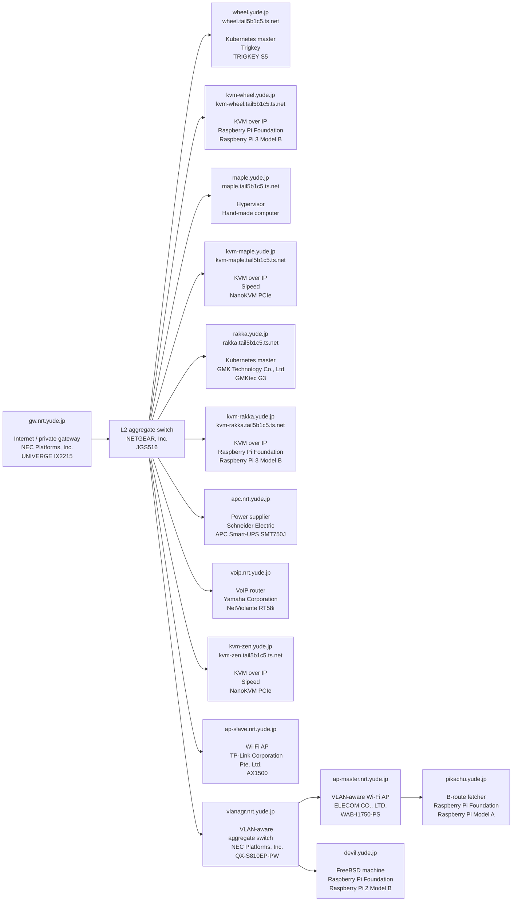

# yude.jp

## Subnet / Naming conventions for service hosts

- Tailscale: 100.64.0.0/16
    - `*.tail5b1c5.ts.net`
- Private gateway: 192.168.30.0/24
    - `*.*.yude.jp`
- Guest: 192.168.200.0/24
- The Internet
    - `*.yude.jp`

## NOC
### nrt.yude.jp (Chiba, Japan)

#### Connectivity

- AS2519 (ARTERIA Networks Corporation)

#### Subnet

- Home: 192.168.100.0/24

#### Topology

