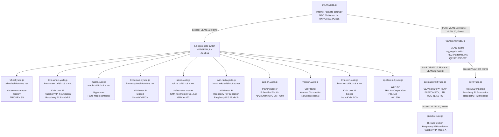
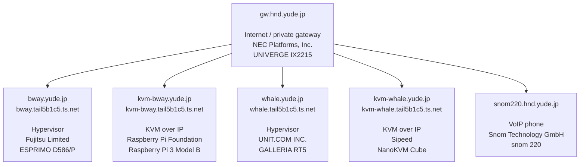
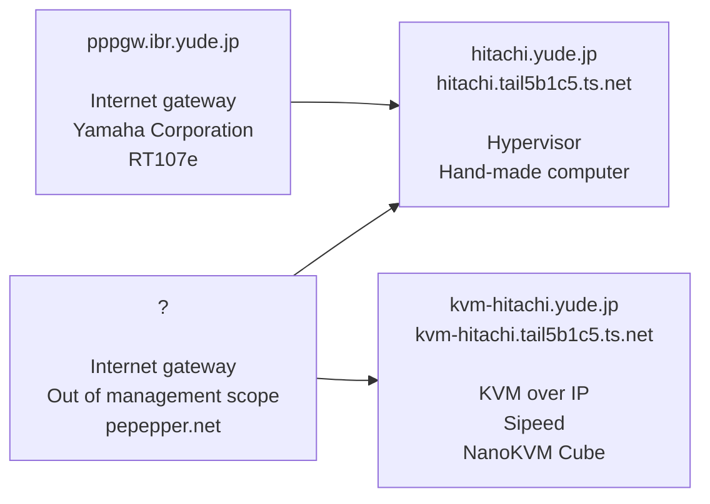
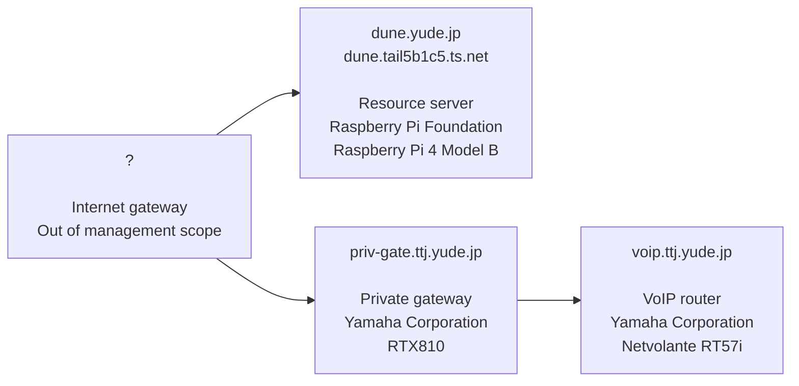
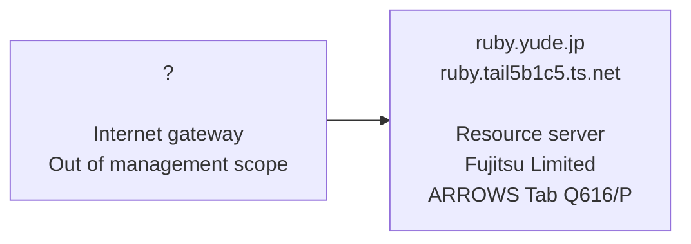
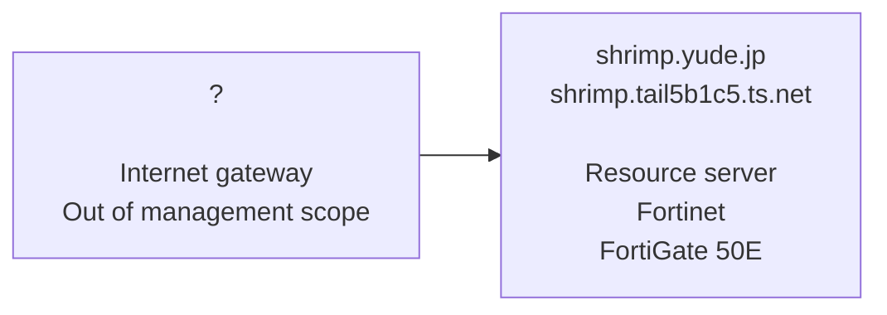
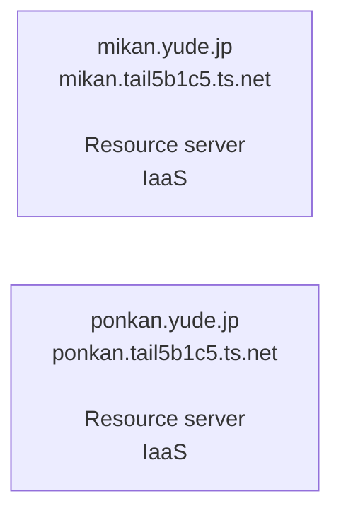

# yude.jp

## Subnet / Naming conventions for hosts in this network

- Tailscale: 100.64.0.0/16
    - `*.tail5b1c5.ts.net`
- Private gateway: 192.168.30.0/24
    - `*.*.yude.jp`
- Guest: 192.168.200.0/24
- The Internet
    - `*.yude.jp`

## NOC
### nrt.yude.jp (Chiba, Japan)

#### Connectivity

- AS2519 (ARTERIA Networks Corporation)
    - Default route of all VLANs

#### VLAN

- VLAN 10
    - Home: 192.168.100.0/24
- VLAN 20
    - Guest

#### Topology

### hnd.yude.jp (Tokyo, Japan)

#### Connectivity

- AS2516 (KDDI Corporation)
    - Default route of Native VLAN
- AS150363 (SoftEther Corporation)
    - Default route of VLAN 20

#### VLAN

- Native
    - Home: 192.168.0.0/24
- VLAN 20
    - Guest

#### Topology

### ibr.yude.jp (Ibaraki, Japan)

#### Connectivity

- AS2518 (BIGLOBE)
    - Default route of Native VLAN

#### VLAN

- Native
    - Home: (redacted)
    - PPP: 192.168.100.0/24

#### Topology

### ttj.yude.jp (Tottori, Japan)

#### Connectivity

- AS131925 (FAMILY NET JAPAN INCORPORATED)
    - Default route of Native VLAN

#### VLAN

- Native
    - Home: (redacted)

#### Topology

### izo.yude.jp (Shimane, Japan)

#### Connectivity

- AS2516 (KDDI Corporation)
    - Default route of Native VLAN

#### VLAN

- Native
    - MKNET: (redacted)

#### Topology

### toy.yude.jp (Toyama, Japan)

#### Connectivity

- AS55392 (INTERNET MULTIFEED CO.)
    - Default route of Native VLAN

#### VLAN

- Native
    - Home: (redacted)

#### Topology

### toy.yude.jp (Toyama, Japan)

#### Connectivity

- AS55392 (INTERNET MULTIFEED CO.)
    - Default route of Native VLAN

#### VLAN

- Native
    - Home: (redacted)

#### Topology

### oci.yude.jp (Oracle Cloud Infrastructure; Osaka, Japan)

#### Connectivity

- AS31898 (Oracle Corporation)

#### Topology

